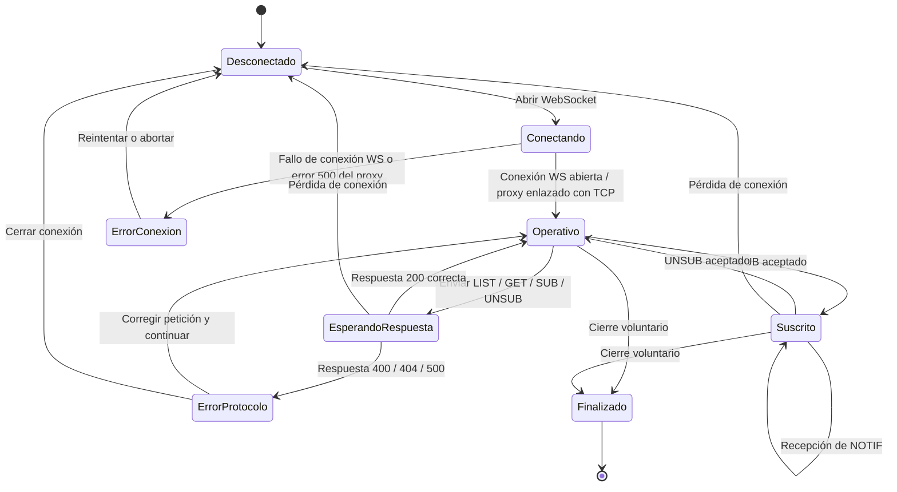
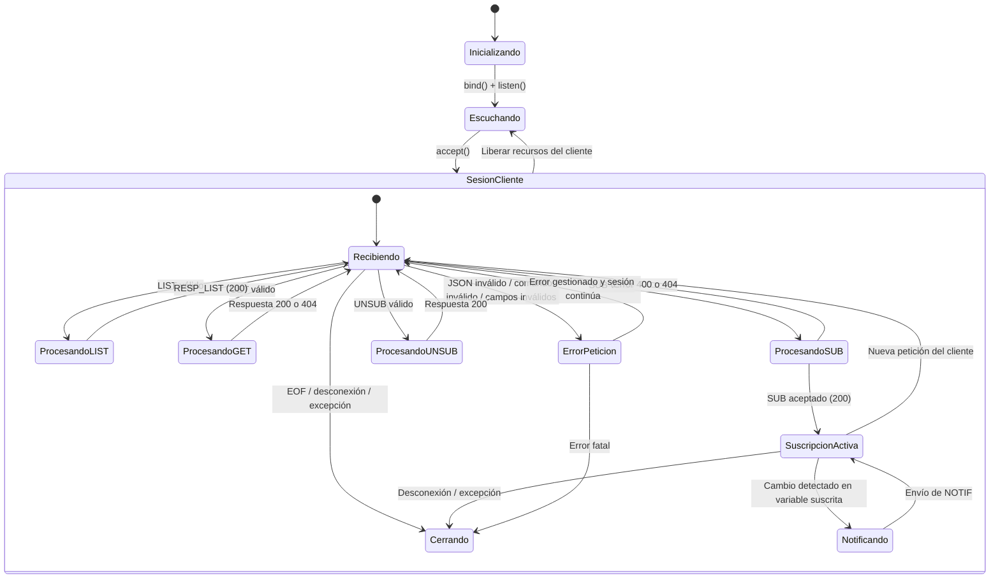
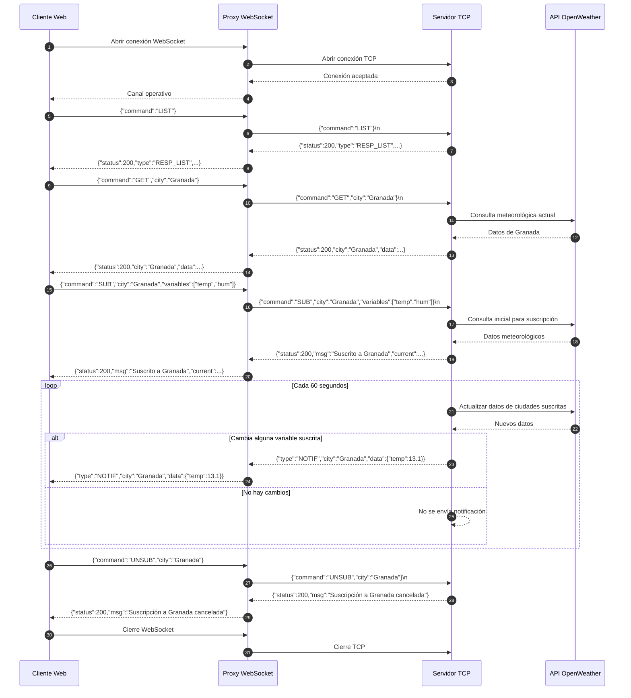

# MeteoApp PRO ☁️ - Sistema de Monitorización Meteorológica

Este proyecto conforma un Asistente Meteorológico de arquitectura distribuida diseñado para **entornos aislados (Máquinas Virtuales)**, compuesto por un motor base TCP estándar (`servidor.py` y `cliente.py`), extendido a través de una App Web interactiva de aspecto premium usando WebSockets.

---

## 🏗️ Arquitectura del Sistema

El proyecto opera con los siguientes componentes principales:

1. **`servidor.py` (Backend Meteorológico)**: Obtiene datos del clima en vivo usando OpenWeatherMap. Trabaja en el puerto TCP nativo `5000`. Manténe un estado reactivo y envía notificaciones PUSH al detectar variaciones climáticas en ciudades suscritas.
2. **`proxy.py` (Puente Web-TCP)**: Actúa como pasarela intermedia bidireccional entre la app web (que corre en un navegador) y el servidor Python. Escucha peticiones WebSocket en el puerto `8080`.
3. **`web/index.html` (MeteoApp PRO)**: El frontend de cliente gráfico. Diseño *Glassmorphism* usando CSS puro e interactividad asíncrona garantizada con Vanilla Javascript.
4. **`cliente.py` (Consola Alternativa)**: Cliente legacy de terminal para interactuar manualmente con JSONs puros si se desea evitar la interfaz gráfica.

# Protocolo de Monitorización Meteorológica con Suscripción y Notificaciones

## 1. Descripción general

Este proyecto implementa un **protocolo de aplicación meteorológico** que permite a múltiples clientes:

- realizar **consultas puntuales** del estado meteorológico de una ciudad,
- solicitar el **catálogo de ciudades disponibles**,
- **suscribirse** a cambios en variables meteorológicas,
- y **cancelar suscripciones** previamente realizadas.

El sistema está compuesto por tres elementos:

- **Cliente web**: interfaz desde la que el usuario realiza las operaciones.
- **Proxy WebSocket**: recibe mensajes del cliente web y los reenvía al servidor TCP.
- **Servidor meteorológico**: procesa peticiones, consulta la API externa de OpenWeather y envía respuestas o notificaciones.

La finalidad del protocolo es diferenciar claramente entre:

- operaciones de **consulta puntual**,
- y operaciones de **suscripción con notificaciones automáticas**.

---

## 2. Arquitectura del sistema

La arquitectura sigue este esquema:

```text
Cliente Web  <----WebSocket---->  Proxy  <----TCP---->  Servidor Meteorológico
```

### Funcionamiento general

1. El cliente web envía mensajes en formato **JSON** al proxy mediante **WebSocket**.
2. El proxy valida que el mensaje sea JSON válido y lo reenvía al servidor mediante **TCP**.
3. El servidor procesa la petición:
   - consulta puntual,
   - listado de ciudades,
   - suscripción,
   - cancelación de suscripción.
4. Si existen suscripciones activas, el servidor revisa periódicamente el estado meteorológico y envía **notificaciones automáticas** cuando detecta cambios en las variables suscritas.

---

## 3. Transporte y delimitación de mensajes

## 3.1. Transporte entre cliente y proxy

Entre el cliente web y el proxy se utiliza **WebSocket**.

- Cada frame contiene un único mensaje JSON en texto.
- El proxy actúa como pasarela entre WebSocket y TCP.

## 3.2. Transporte entre proxy y servidor

Entre el proxy y el servidor se utiliza **TCP**.

Cada mensaje:

- está codificado en **UTF-8**,
- tiene formato **JSON**,
- y termina con un salto de línea `\n`.

Por tanto, el flujo TCP tiene la forma:

```text
<json>\n
<json>\n
<json>\n
```

El servidor divide los mensajes recibidos usando `\n` como separador.

---

## 4. Tipos de mensajes del protocolo

El protocolo define los siguientes tipos de mensajes.

### 4.1. Mensajes cliente → servidor

- `LIST`: solicita el catálogo de ciudades disponibles.
- `GET`: solicita el estado meteorológico actual de una ciudad.
- `SUB`: suscribe al cliente a alertas sobre cambios de variables meteorológicas.
- `UNSUB`: cancela una suscripción concreta o todas las suscripciones.

### 4.2. Mensajes servidor → cliente

- respuesta a `LIST`,
- respuesta a `GET`,
- respuesta a `SUB`,
- respuesta a `UNSUB`,
- mensajes de error,
- notificación asíncrona `NOTIF`.

Además, el proxy puede generar un error `500` si no logra conectar con el servidor TCP.

---

## 5. Especificación formal del protocolo en ABNF
Existe un pdf adjunto en el repositorio donde poder ver esto más desarrollado.
A continuación se define formalmente el formato de los mensajes del protocolo mediante **ABNF**.

> **Nota**: aunque JSON no obliga a un orden fijo de los campos, en esta especificación se muestra un orden canónico recomendado para facilitar la interoperabilidad.

```abnf
; =========================================================
; PROTOCOLO METEO
; Serialización JSON UTF-8
; En TCP, cada mensaje termina en LF (%x0A)
; =========================================================

tcp-message     = message LF
LF              = %x0A
OWS             = *(SP / HTAB)

message         = request / response / notification

; =========================
; PETICIONES
; =========================

request         = list-req / get-req / sub-req / unsub-req

list-req        = "{" OWS q-command OWS ":" OWS q-LIST OWS "}"

get-req         = "{" OWS
                  q-command OWS ":" OWS q-GET
                  [ OWS "," OWS q-city OWS ":" OWS city ]
                  OWS "}"

sub-req         = "{" OWS
                  q-command OWS ":" OWS q-SUB
                  [ OWS "," OWS q-city OWS ":" OWS city ]
                  [ OWS "," OWS q-variables OWS ":" OWS variable-list ]
                  OWS "}"

unsub-req       = "{" OWS
                  q-command OWS ":" OWS q-UNSUB
                  [ OWS "," OWS q-city OWS ":" OWS city ]
                  OWS "}"

; =========================
; RESPUESTAS
; =========================

response        = list-resp / get-resp-ok / sub-resp-ok /
                  unsub-resp-ok / error-resp / proxy-error-resp

list-resp       = "{" OWS
                  q-status OWS ":" OWS status-200 OWS "," OWS
                  q-type   OWS ":" OWS q-RESP_LIST OWS "," OWS
                  q-data   OWS ":" OWS city-list OWS "," OWS
                  q-msg    OWS ":" OWS text
                  OWS "}"

get-resp-ok     = "{" OWS
                  q-status OWS ":" OWS status-200 OWS "," OWS
                  q-city   OWS ":" OWS city OWS "," OWS
                  q-data   OWS ":" OWS weather-data
                  OWS "}"

sub-resp-ok     = "{" OWS
                  q-status  OWS ":" OWS status-200 OWS "," OWS
                  q-msg     OWS ":" OWS text OWS "," OWS
                  q-current OWS ":" OWS weather-data
                  OWS "}"

unsub-resp-ok   = "{" OWS
                  q-status OWS ":" OWS status-200 OWS "," OWS
                  q-msg    OWS ":" OWS text
                  OWS "}"

error-resp      = "{" OWS
                  q-status OWS ":" OWS (status-400 / status-404 / status-500) OWS "," OWS
                  q-msg    OWS ":" OWS text
                  OWS "}"

proxy-error-resp = error-resp

; =========================
; NOTIFICACIONES
; =========================

notification    = "{" OWS
                  q-type OWS ":" OWS q-NOTIF OWS "," OWS
                  q-city OWS ":" OWS city OWS "," OWS
                  q-data OWS ":" OWS notif-data
                  OWS "}"

; =========================
; ESTRUCTURAS INTERNAS
; =========================

city-list       = "[" OWS city *( OWS "," OWS city ) OWS "]"

variable-list   = "[" OWS variable *( OWS "," OWS variable ) OWS "]"

variable        = q-temp / q-hum / q-pres / q-wind

weather-data    = "{" OWS
                  temp-member OWS "," OWS
                  hum-member  OWS "," OWS
                  pres-member OWS "," OWS
                  wind-member
                  OWS "}"

notif-data      = "{" OWS
                  change-member *( OWS "," OWS change-member )
                  OWS "}"

change-member   = temp-member / hum-member / pres-member / wind-member

temp-member     = q-temp OWS ":" OWS number
hum-member      = q-hum  OWS ":" OWS number
pres-member     = q-pres OWS ":" OWS number
wind-member     = q-wind OWS ":" OWS number

; =========================
; NOMBRES DE CAMPOS
; =========================

q-command       = DQUOTE "command" DQUOTE
q-city          = DQUOTE "city" DQUOTE
q-variables     = DQUOTE "variables" DQUOTE
q-status        = DQUOTE "status" DQUOTE
q-type          = DQUOTE "type" DQUOTE
q-data          = DQUOTE "data" DQUOTE
q-msg           = DQUOTE "msg" DQUOTE
q-current       = DQUOTE "current" DQUOTE

; =========================
; VALORES LITERALES
; =========================

q-LIST          = DQUOTE "LIST" DQUOTE
q-GET           = DQUOTE "GET" DQUOTE
q-SUB           = DQUOTE "SUB" DQUOTE
q-UNSUB         = DQUOTE "UNSUB" DQUOTE
q-RESP_LIST     = DQUOTE "RESP_LIST" DQUOTE
q-NOTIF         = DQUOTE "NOTIF" DQUOTE

q-temp          = DQUOTE "temp" DQUOTE
q-hum           = DQUOTE "hum" DQUOTE
q-pres          = DQUOTE "pres" DQUOTE
q-wind          = DQUOTE "wind" DQUOTE

status-200      = "200"
status-400      = "400"
status-404      = "404"
status-500      = "500"

; =========================
; TIPOS BÁSICOS
; =========================

city            = string
text            = string

number          = ["-"] int [ frac ]
int             = "0" / (NZDIGIT *DIGIT)
NZDIGIT         = %x31-39
frac            = "." 1*DIGIT

string          = DQUOTE *char DQUOTE
char            = unescaped / escape
unescaped       = %x20-21 / %x23-5B / %x5D-FF
escape          = %x5C ( DQUOTE / %x5C / "/" / "b" / "f" / "n" / "r" / "t" )
```

---

## 6. Definición de mensajes y semántica

## 6.1. Mensaje `LIST`

Permite solicitar al servidor el catálogo de ciudades disponibles.

### Petición

```json
{"command":"LIST"}
```

### Respuesta correcta

```json
{
  "status": 200,
  "type": "RESP_LIST",
  "data": ["Madrid", "Granada", "Barcelona"],
  "msg": "Actualmente tengo 3 ciudades disponibles."
}
```

### Campos

- `command`: obligatorio. Valor fijo `"LIST"`.

### Respuesta

- `status`: obligatorio. Valor `200`.
- `type`: obligatorio. Valor `"RESP_LIST"`.
- `data`: obligatorio. Lista de ciudades soportadas.
- `msg`: obligatorio. Mensaje informativo.

---

## 6.2. Mensaje `GET`

Permite realizar una consulta puntual del estado meteorológico actual de una ciudad.

### Petición

```json
{"command":"GET","city":"Granada"}
```

### Petición válida sin `city`

```json
{"command":"GET"}
```

En este caso, el servidor utiliza la ciudad `"Madrid"` por defecto.

### Respuesta correcta

```json
{
  "status": 200,
  "city": "Granada",
  "data": {
    "temp": 12.4,
    "hum": 73,
    "pres": 1018,
    "wind": 3.5
  }
}
```

### Respuesta de error

```json
{"status":404,"msg":"Ciudad no encontrada"}
```

### Campos

- `command`: obligatorio. Valor `"GET"`.
- `city`: opcional. Nombre de la ciudad.

### Restricciones

- Si `city` no aparece, el valor por defecto es `"Madrid"`.
- La validez real de la ciudad depende de si la API externa es capaz de resolverla correctamente.

---

## 6.3. Mensaje `SUB`

Permite suscribirse a notificaciones automáticas sobre una ciudad y un conjunto de variables meteorológicas.

### Petición mínima

```json
{"command":"SUB","city":"Valdepenas"}
```

### Petición con variables explícitas

```json
{"command":"SUB","city":"Granada","variables":["temp","hum","wind","pres"]}
```

### Petición válida sin `city` ni `variables`

```json
{"command":"SUB"}
```

En ese caso:

- la ciudad por defecto es `"Madrid"`,
- y las variables por defecto son `["temp","hum","pres","wind"]`.

### Respuesta correcta

```json
{
  "status": 200,
  "msg": "Suscrito a Granada",
  "current": {
    "temp": 12.4,
    "hum": 73,
    "pres": 1018,
    "wind": 3.5
  }
}
```

### Respuesta de error por ciudad no válida

```json
{"status":404,"msg":"Ciudad no válida"}
```

### Respuesta de error por suscripción duplicada

```json
{"status":400,"msg":"Ya estás suscrito a las alertas de Granada. ✅"}
```

### Campos

- `command`: obligatorio. Valor `"SUB"`.
- `city`: opcional. Nombre de la ciudad.
- `variables`: opcional. Lista de variables a monitorizar.

### Variables permitidas

- `"temp"`: temperatura
- `"hum"`: humedad
- `"pres"`: presión
- `"wind"`: velocidad del viento

### Restricciones

- No se permite suscribirse dos veces a la misma ciudad dentro de la misma conexión.
- Un cliente puede tener varias suscripciones activas a distintas ciudades.
- La suscripción se mantiene asociada a la conexión del cliente.

---

## 6.4. Mensaje `UNSUB`

Permite cancelar una suscripción concreta o todas las suscripciones activas del cliente.

### Cancelar suscripción de una ciudad concreta

```json
{"command":"UNSUB","city":"Granada"}
```

### Cancelar todas las suscripciones

```json
{"command":"UNSUB"}
```

### Respuesta al cancelar una ciudad

```json
{"status":200,"msg":"Suscripción a Granada cancelada"}
```

### Respuesta al cancelar todas las suscripciones

```json
{"status":200,"msg":"Todas las suscripciones canceladas"}
```

### Campos

- `command`: obligatorio. Valor `"UNSUB"`.
- `city`: opcional.

### Semántica

- Si `city` aparece, se elimina solo la suscripción a esa ciudad.
- Si `city` no aparece, se eliminan todas las suscripciones de la conexión.

---

## 6.5. Mensaje `NOTIF`

Es una notificación asíncrona enviada por el servidor cuando cambia alguna de las variables a las que el cliente está suscrito.

### Ejemplo

```json
{
  "type":"NOTIF",
  "city":"Granada",
  "data":{
    "temp":13.1,
    "wind":4.0
  }
}
```

### Campos

- `type`: obligatorio. Valor `"NOTIF"`.
- `city`: obligatorio. Ciudad asociada al cambio.
- `data`: obligatorio. Objeto con una o varias variables modificadas.

### Restricciones

- `data` contiene solo las variables que han cambiado desde el último valor enviado al cliente.
- Las claves permitidas en `data` son:
  - `temp`
  - `hum`
  - `pres`
  - `wind`

---

## 7. Tipos de datos utilizados

## 7.1. Tipo `city`

Cadena JSON que representa el nombre de una ciudad.

### Ejemplos

```json
"Madrid"
"Granada"
"Valdepenas"
```

---

## 7.2. Tipo `variables`

Lista JSON de cadenas con valores pertenecientes al siguiente conjunto:

```json
["temp", "hum", "pres", "wind"]
```

---

## 7.3. Tipo `weather-data`

Objeto JSON con cuatro variables meteorológicas numéricas:

- `temp`: temperatura
- `hum`: humedad
- `pres`: presión atmosférica
- `wind`: velocidad del viento

### Ejemplo

```json
{
  "temp": 8.3,
  "hum": 79,
  "pres": 1016,
  "wind": 3.93
}
```

---

## 7.4. Tipo `status`

Código numérico de estado:

- `200`: operación correcta
- `400`: petición válida sintácticamente, pero incorrecta para el estado actual
- `404`: ciudad no válida o no encontrada
- `500`: error interno del proxy

---

## 8. Restricciones sintácticas y semánticas del protocolo

Las principales restricciones observadas en la implementación son las siguientes:

### 8.1. Codificación

Todos los mensajes deben enviarse en **UTF-8**.

### 8.2. Delimitación de mensajes

En el canal TCP, cada mensaje JSON debe finalizar con un salto de línea `\n`.

### 8.3. Validez sintáctica

Cada mensaje debe ser un **JSON válido**.

El proxy valida la sintaxis JSON antes de reenviar el mensaje al servidor.

### 8.4. Ciudad por defecto

En las peticiones `GET` y `SUB`, si el campo `city` no aparece, se utiliza `"Madrid"` por defecto.

### 8.5. Variables por defecto

En las peticiones `SUB`, si el campo `variables` no aparece, se asume:

```json
["temp","hum","pres","wind"]
```

### 8.6. Asociación a conexión

Las suscripciones quedan asociadas al socket del cliente. Si la conexión se cierra, las suscripciones desaparecen.

### 8.7. Duplicidad de suscripción

No se permite suscribirse dos veces a la misma ciudad dentro de una misma conexión. En ese caso, el servidor responde con estado `400`.

### 8.8. Notificaciones automáticas

El servidor revisa periódicamente las ciudades con suscripciones activas y genera una notificación `NOTIF` cuando detecta cambios en alguna de las variables suscritas.

### 8.9. Frecuencia de actualización

El bucle de actualización del servidor se ejecuta aproximadamente cada **60 segundos**.

---

## 9. Ejemplos completos de intercambio

## 9.1. Consulta puntual

### Cliente

```json
{"command":"GET","city":"Granada"}
```

### Servidor

```json
{"status":200,"city":"Granada","data":{"temp":12.4,"hum":73,"pres":1018,"wind":3.5}}
```

---

## 9.2. Alta de suscripción

### Cliente

```json
{"command":"SUB","city":"Valdepenas","variables":["temp","hum","wind","pres"]}
```

### Servidor

```json
{"status":200,"msg":"Suscrito a Valdepenas","current":{"temp":8.3,"hum":79,"pres":1016,"wind":3.93}}
```

### Notificación posterior

```json
{"type":"NOTIF","city":"Valdepenas","data":{"hum":81}}
```

---

## 9.3. Baja de suscripción

### Cliente

```json
{"command":"UNSUB","city":"Valdepenas"}
```

### Servidor

```json
{"status":200,"msg":"Suscripción a Valdepenas cancelada"}
```

---

## 9.4. Solicitud del catálogo

### Cliente

```json
{"command":"LIST"}
```

### Servidor

```json
{
  "status":200,
  "type":"RESP_LIST",
  "data":["Madrid","Granada","Barcelona","Sevilla"],
  "msg":"Actualmente tengo 4 ciudades disponibles."
}
```

---

## 10. Comportamiento del proxy

El proxy WebSocket no modifica la semántica del protocolo, sino que adapta el transporte entre cliente web y servidor TCP.

Sus funciones son:

- aceptar conexiones WebSocket en `ws://0.0.0.0:8080`,
- abrir una conexión TCP contra el servidor meteorológico,
- validar que el mensaje del cliente sea JSON,
- añadir `\n` antes de reenviar cada mensaje al servidor,
- reenviar al cliente web las respuestas y notificaciones recibidas por TCP.

En caso de que el proxy no pueda conectarse al servidor TCP, puede enviar al cliente el siguiente error:

```json
{"status":500,"msg":"Error interno del proxy al conectar al servidor."}
```

---

## 11. Consideraciones de implementación

### 11.1. Diferencia entre cliente y proxy

Aunque en la práctica el navegador actúa como cliente final, el código proporcionado como “cliente” corresponde realmente a un **proxy WebSocket ↔ TCP**.

Por tanto, el protocolo de aplicación real se implementa entre:

- cliente web y proxy mediante WebSocket,
- y proxy y servidor mediante TCP.

### 11.2. Dependencia de una API externa

El servidor obtiene los datos meteorológicos usando la API de **OpenWeather**.  
Por ello, la disponibilidad y validez de algunas respuestas dependen también del servicio externo.

### 11.3. Catálogo de ciudades

El servidor mantiene una lista de ciudades soportadas, utilizada en la respuesta a `LIST`. Sin embargo, la operación `GET` realmente consulta la API externa y puede aceptar ciudades no incluidas inicialmente en el catálogo si la API las resuelve correctamente.

---

## 12. Puesta en marcha

## 12.1. Servidor

Instalar dependencias si es necesario:

```bash
sudo apt install python3-requests -y
```

Ejecutar el servidor TCP:

```bash
python3 servidor.py
```

Salida esperada:

```text
--- SERVIDOR ACTIVO EN 0.0.0.0:5000 ---
```

## 12.2. Proxy

Instalar dependencias si es necesario:

```bash
sudo apt install python3-websockets -y
```

Ejecutar el proxy:

```bash
python3 proxy.py
```

Salida esperada:

```text
--- PROXY WEBSOCKETS INICIADO EN ws://0.0.0.0:8080 ---
Redirigiendo tráfico a TCP 127.0.0.1:5000
```

---

## 13. Conclusión

El protocolo definido permite implementar un sistema de monitorización meteorológica con dos modos de operación:

- **consulta puntual** del estado actual,
- **suscripción a notificaciones automáticas** cuando cambian determinadas variables.

La especificación formal en ABNF detalla la estructura de los mensajes, los campos obligatorios y opcionales, los tipos de datos admitidos y las principales restricciones sintácticas y semánticas del protocolo. De este modo, un tercero puede implementar un cliente compatible sin necesidad de consultar el código fuente original.

## 14. Diagramas de estados
Existe un pdf adjunto en el repositorio donde poder ver esto más desarrollado.
### 14.1. Diagrama de estados del cliente

> En este sistema, el cliente lógico es la aplicación web que se comunica con el servidor a través del proxy WebSocket. El diagrama refleja los estados desde el punto de vista del cliente de aplicación.



### 14.2. Explicación del comportamiento del cliente

El cliente comienza en estado **Desconectado**. Cuando abre el canal WebSocket, pasa a **Conectando**. Si la conexión se establece correctamente y el proxy logra enlazar con el servidor TCP, entra en **Operativo**, estado desde el que puede enviar peticiones `LIST`, `GET`, `SUB` y `UNSUB`.

Cuando el cliente envía una petición, pasa temporalmente a **EsperandoRespuesta**. Si el servidor responde correctamente con estado `200`, vuelve a **Operativo**. Si recibe un error (`400`, `404` o `500`), entra en **ErrorProtocolo**, desde donde puede corregir la petición o finalizar la sesión.

Cuando una suscripción `SUB` es aceptada, el cliente entra en estado **Suscrito**. En este estado puede seguir recibiendo mensajes `NOTIF` de manera asíncrona mientras la conexión permanezca activa. Si solicita `UNSUB`, vuelve a **Operativo**. Si la conexión se pierde, pasa a **Desconectado**.

### 14.3. Diagrama de estados del servidor

> El siguiente diagrama representa el comportamiento del servidor respecto a cada conexión de cliente. El servidor global permanece en escucha continua, mientras que cada sesión cliente evoluciona por los estados mostrados.



### 14.4. Explicación del comportamiento del servidor

El servidor arranca en **Inicializando**, crea el socket TCP, hace `bind`, entra en modo escucha y pasa al estado **Escuchando**. Cuando un cliente establece conexión, el servidor crea una sesión independiente para ese cliente.

Dentro de cada sesión, el estado principal es **Recibiendo**, en el que el servidor espera mensajes JSON terminados en salto de línea. Dependiendo del comando recibido, pasa a uno de los estados de procesamiento:

- **ProcesandoLIST**, si el cliente solicita el catálogo de ciudades.
- **ProcesandoGET**, si pide una consulta puntual.
- **ProcesandoSUB**, si solicita una suscripción.
- **ProcesandoUNSUB**, si quiere cancelar suscripciones.

Si una suscripción es aceptada, la sesión entra en **SuscripciónActiva**. En ese estado, el cliente sigue pudiendo enviar nuevas peticiones, y además el servidor puede entrar en **Notificando** cuando detecta cambios en las variables suscritas y envía un mensaje `NOTIF`.

Si se produce una desconexión, un cierre del socket o una excepción no recuperable, la sesión pasa a **Cerrando**, se eliminan las suscripciones asociadas a esa conexión y el servidor vuelve a **Escuchando** para aceptar nuevos clientes.

---

## 15. Diagrama de secuencia

El siguiente diagrama muestra una operación típica completa: establecimiento de conexión, consulta del catálogo, consulta puntual, suscripción, recepción de notificación y cancelación de la suscripción.



### 15.1. Explicación del flujo temporal

La secuencia comienza cuando el cliente establece una conexión WebSocket con el proxy. A continuación, el proxy abre una conexión TCP con el servidor. Una vez creada la ruta de comunicación, el cliente ya puede enviar mensajes del protocolo.

Primero puede solicitar el catálogo mediante `LIST`, luego hacer una consulta puntual con `GET`, y después registrar una suscripción con `SUB`. Una vez activa la suscripción, el servidor revisa periódicamente el estado meteorológico de las ciudades suscritas. Si detecta cambios en alguna variable monitorizada, genera una notificación `NOTIF`, que atraviesa el proxy y llega al cliente.

Finalmente, el cliente puede cancelar la suscripción con `UNSUB` o cerrar directamente la conexión. Si la conexión se cierra, las suscripciones asociadas a esa sesión desaparecen.

---

## 16. Gestión explícita de errores

Para que el protocolo quede correctamente especificado, es necesario definir cómo actuar ante errores sintácticos, errores semánticos y fallos de comunicación.

### 16.1. Errores contemplados

#### a) Mensaje mal formado

Se produce cuando el cliente envía un mensaje que no es JSON válido o que no respeta la estructura esperada.

**Ejemplo:**

```json
{"command":"GET","city":Granada}
```

Aquí `Granada` no está entre comillas, por lo que el JSON es inválido.

**Respuesta del sistema:**

- En la implementación actual, el proxy detecta el JSON inválido y lo registra en consola, pero no devuelve una respuesta formal al cliente.
- A nivel de especificación del protocolo, la respuesta correcta debería ser:

```json
{"status":400,"msg":"JSON mal formado"}
```

**Reacción esperada del cliente:**

- No debe asumir que la operación se ha realizado.
- Debe corregir el mensaje y reenviarlo.
- La conexión puede mantenerse abierta si el error es recuperable.

#### b) Comando no soportado

Se produce cuando el campo `command` tiene un valor no reconocido.

**Ejemplo:**

```json
{"command":"DELETE","city":"Granada"}
```

**Respuesta del sistema:**

- En la implementación actual, este caso no genera una respuesta explícita.
- En la especificación del protocolo debe definirse:

```json
{"status":400,"msg":"Comando no soportado"}
```

**Reacción esperada del cliente:**

- Mostrar un error de operación inválida.
- Permanecer en estado operativo si la conexión sigue activa.

#### c) Operación no permitida en el estado actual

El caso más claro en la implementación es intentar suscribirse dos veces a la misma ciudad dentro de la misma conexión.

**Ejemplo:**

```json
{"command":"SUB","city":"Granada"}
```

enviada dos veces seguidas.

**Respuesta del servidor:**

```json
{"status":400,"msg":"Ya estás suscrito a las alertas de Granada. ✅"}
```

**Reacción esperada del cliente:**

- Mantener la suscripción previa.
- Informar al usuario de que ya existe una suscripción activa.
- No reiniciar el flujo ni duplicar el estado interno.

#### d) Petición con ciudad inválida o no encontrada

Se produce cuando la ciudad no puede resolverse mediante la API meteorológica externa.

**Ejemplo:**

```json
{"command":"GET","city":"CiudadInventada"}
```

**Respuesta del servidor en `GET`:**

```json
{"status":404,"msg":"Ciudad no encontrada"}
```

**Respuesta del servidor en `SUB`:**

```json
{"status":404,"msg":"Ciudad no válida"}
```

**Reacción esperada del cliente:**

- No debe dar por válida la consulta o la suscripción.
- Debe mostrar el error al usuario.
- Puede permitir que el usuario introduzca otra ciudad.

#### e) Pérdida de conexión entre cliente y proxy

Se produce cuando se cierra el WebSocket o se interrumpe la comunicación.

**Respuesta del sistema:**

- No siempre existe un mensaje de error formal; puede detectarse por cierre del canal.
- El cliente debe pasar a estado **Desconectado**.

**Reacción esperada del cliente:**

- Informar de la desconexión.
- Permitir reconexión manual o automática.
- Si había suscripciones activas, deberá volver a enviarlas tras reconectar, ya que están asociadas a la sesión anterior.

#### f) Pérdida de conexión entre proxy y servidor

Se produce cuando el proxy no consigue abrir o mantener la conexión TCP con el servidor.

**Respuesta del proxy:**

```json
{"status":500,"msg":"Error interno del proxy al conectar al servidor."}
```

**Reacción esperada del cliente:**

- Pasar a estado de error de conexión.
- No considerar la operación completada.
- Permitir reintento posterior.

#### g) Timeout al consultar la API externa

La implementación usa:

```python
requests.get(url, timeout=5)
```

Por tanto, si la API externa tarda demasiado, la petición expira.

**Comportamiento actual del servidor:**

- El error se captura y se trata como fallo de obtención de datos.
- En `GET` y `SUB`, esto acaba generando una respuesta equivalente a ciudad no válida o no encontrada.
- En el bucle de notificaciones, simplemente no se actualizan los datos ni se envía notificación.

**Observación importante:**

Desde el punto de vista de la práctica, sería más preciso distinguir este caso con un error específico, por ejemplo:

```json
{"status":504,"msg":"Timeout consultando servicio meteorológico externo"}
```

aunque esta mejora no está implementada todavía en el código actual.

**Reacción esperada del cliente:**

- Tratarlo como un fallo temporal.
- Permitir repetir la consulta más tarde.
- No eliminar automáticamente suscripciones si el fallo es puntual.

### 16.2. Política general de reacción del cliente

Ante cualquier error, el cliente debe aplicar estas reglas:

1. Si recibe `200`, considera la operación completada correctamente.
2. Si recibe `400`, interpreta que la petición era inválida o no permitida en el estado actual.
3. Si recibe `404`, interpreta que la ciudad solicitada no es válida o no se ha encontrado.
4. Si recibe `500`, interpreta que existe un fallo interno del proxy o del servicio.
5. Si detecta cierre de conexión sin respuesta, debe asumir pérdida de sesión.
6. Si la sesión se pierde, todas las suscripciones asociadas a esa conexión deben considerarse canceladas y, si el usuario sigue interesado, deberán reenviarse tras la reconexión.

### 16.3. Resumen de errores del protocolo

Se recomienda que la especificación del protocolo contemple al menos las siguientes respuestas:

```json
{"status":400,"msg":"JSON mal formado"}
{"status":400,"msg":"Comando no soportado"}
{"status":400,"msg":"Ya estás suscrito a las alertas de <ciudad>"}
{"status":404,"msg":"Ciudad no encontrada"}
{"status":404,"msg":"Ciudad no válida"}
{"status":500,"msg":"Error interno del proxy al conectar al servidor."}
```

Opcionalmente, para una versión más robusta:

```json
{"status":504,"msg":"Timeout consultando servicio meteorológico externo"}
```

---

## 17. Conclusión sobre el comportamiento dinámico del protocolo

Los diagramas de estados muestran que el protocolo distingue claramente entre conexión, operación normal, suscripción activa, notificación asíncrona, error y finalización. El diagrama de secuencia refleja el orden temporal en el que se intercambian los mensajes entre cliente, proxy, servidor y API externa.

Además, la gestión explícita de errores permite definir cómo debe reaccionar cada extremo ante mensajes inválidos, comandos no soportados, operaciones prohibidas, fallos de conectividad y timeouts, haciendo que la especificación sea lo bastante precisa como para que un tercero pueda implementar el protocolo sin consultar el código fuente.
